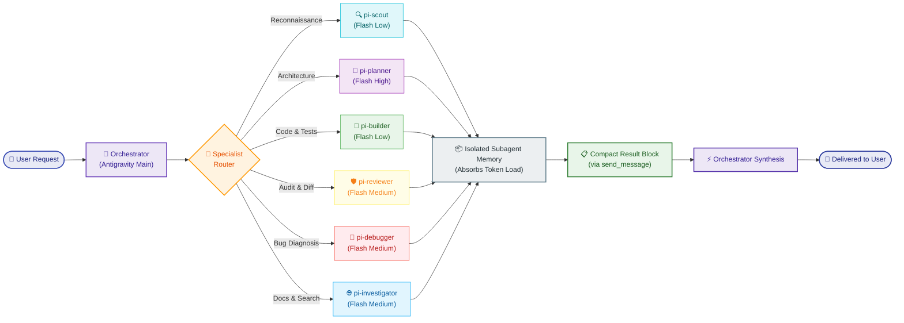

<div align="center">

# Gravity for Antigravity — Multi-Agent Orchestration Suite

### Stop doing everything yourself. Orchestrate.

[](https://github.com/H3lloLLM/Gravity-for-Antigravity)
[](LICENSE)
[](https://github.com/toonight/get-shit-done-for-antigravity)
[](#cross-platform-support)
[](#)

A plugin-based multi-agent orchestration system for Google Antigravity that routes every task to the right specialist subagent (Pi subagents), keeping the main AI context lean, fast, and razor-sharp.

Based on [GSD for Antigravity](https://github.com/toonight/get-shit-done-for-antigravity) • Upstream reference: [Pi by earendil-works](https://github.com/H3lloLLM/Gravity-for-Antigravity)

[Quick Start](#getting-started) • [How It Works](#how-it-works) • [Pi Subagents](#pi-subagents-catalog) • [Why It Works](#why-it-works) • [Documentation](#documentation) • [Philosophy](#philosophy)

</div>

---

## The Problem

<table>
<tr>
<th width="50%">❌ Without Gravity for Antigravity (Monolithic Agent)</th>
<th width="50%">✅ With Gravity for Antigravity (Specialist Orchestration)</th>
</tr>
<tr>
<td valign="top">

- **Context Bloat:** The orchestrator reads 20+ large files directly, exhausting 70%+ of the token budget before coding begins.
- **Cognitive Fog:** A single agent tries to plan, inspect files, debug, write code, and audit diffs in one long conversation window.
- **Latency & Sluggishness:** Bloated context leads to slower responses, hallucinatory edits, and missed project instructions.
- **No Model Specialization:** Overpaying with reasoning models for mechanical file reading or under-powering architecture plans with low-tier models.
- **Unverified Output:** The agent claims "Everything is tested and working" without capturing empirical output or independent audit proof.

</td>
<td valign="top">

- **Context Hygiene:** Subagents absorb token weight in disposable, isolated execution environments. Parent context stays under 15%.
- **Role Specialization:** 6 dedicated Pi subagents handle reconnaissance, architecture, coding, reviewing, debugging, and web research.
- **High-Speed Execution:** Lightweight context delivers snappy round-trips and laser-accurate diff generation.
- **Dynamic Model Routing:** Pins tasks to optimal models via `model_capabilities.yaml` (fast Flash Low for scout/build, Flash High for planning).
- **Empirical Validation:** Subagents must capture command output, run tests, and undergo independent diff review before returning completion.

</td>
</tr>
</table>

---

## Who This Is For

| User Type | Scenario | How Gravity for Antigravity Helps |
|---|---|---|
| **Solo Developers** | Building complex full-stack features with AI assistance | Offloads bulk file reads, testing, and debugging to disposable subagents so the parent session remains clean and responsive across days of work. |
| **Power Prompt Engineers** | Designing autonomous, multi-step workflows | Provides strict role contracts, tool grants, model pinning, and structured `send_message` result handoffs. |
| **Production & CI/CD Teams** | Running headless, scriptable multi-model batch jobs | Executes concurrent subagent tasks in headless CLI environments (`subagent.sh` + `parallel_subagents.py`) with strict timeouts and structured JSON envelopes. |

---

## Getting Started

### Installation

> [!TIP]
> The installation copies `AGENTS.md` both locally to your workspace and globally to `~/.gemini/config/AGENTS.md` and the plugin rules folder, ensuring strict orchestrator-only discipline is active in every session.

<details open>
<summary><b>Bash (Linux / macOS)</b></summary>

```bash
cd your-project
git clone https://github.com/H3lloLLM/Gravity-for-Antigravity.git gravity
cp -r gravity/.agents ./
cp -r gravity/adapters ./
cp -r gravity/docs ./
cp -r gravity/scripts ./
cp -r gravity/tests ./
cp gravity/AGENTS.md ./
cp gravity/PROJECT_RULES.md ./
cp gravity/model_capabilities.yaml ./
rm -rf gravity

# Install global Antigravity plugin & rules
mkdir -p ~/.gemini/config/plugins/gravity-for-antigravity/agents ~/.gemini/config/plugins/gravity-for-antigravity/skills ~/.gemini/config/plugins/gravity-for-antigravity/rules
cp -r .agents/agents/* ~/.gemini/config/plugins/gravity-for-antigravity/agents/
cp -r .agents/skills/* ~/.gemini/config/plugins/gravity-for-antigravity/skills/
cp AGENTS.md ~/.gemini/config/plugins/gravity-for-antigravity/rules/
cp AGENTS.md ~/.gemini/config/AGENTS.md
```

</details>

<details>
<summary><b>PowerShell (Windows)</b></summary>

```powershell
cd your-project
git clone https://github.com/H3lloLLM/Gravity-for-Antigravity.git gravity
Copy-Item -Recurse gravity\.agents .\
Copy-Item -Recurse gravity\adapters .\
Copy-Item -Recurse gravity\docs .\
Copy-Item -Recurse gravity\scripts .\
Copy-Item -Recurse gravity\tests .\
Copy-Item -Force gravity\AGENTS.md .\
Copy-Item -Force gravity\PROJECT_RULES.md .\
Copy-Item -Force gravity\model_capabilities.yaml .\
Remove-Item -Recurse -Force gravity

# Install global Antigravity plugin & rules
New-Item -ItemType Directory -Force "$HOME\.gemini\config\plugins\gravity-for-antigravity\agents"
New-Item -ItemType Directory -Force "$HOME\.gemini\config\plugins\gravity-for-antigravity\skills"
New-Item -ItemType Directory -Force "$HOME\.gemini\config\plugins\gravity-for-antigravity\rules"
Copy-Item -Recurse -Force .agents\agents\* "$HOME\.gemini\config\plugins\gravity-for-antigravity\agents\"
Copy-Item -Recurse -Force .agents\skills\* "$HOME\.gemini\config\plugins\gravity-for-antigravity\skills\"
Copy-Item -Force AGENTS.md "$HOME\.gemini\config\plugins\gravity-for-antigravity\rules\"
Copy-Item -Force AGENTS.md "$HOME\.gemini\config\AGENTS.md"
```

</details>

---

## How It Works

Gravity for Antigravity enforces **Orchestrator-Only Discipline**. The parent Antigravity agent never attempts direct implementation or bulk code scanning; it delegates each task to a specialist subagent, which works inside an isolated context window and reports back via a structured summary envelope.



### The 6-Step Orchestration Cycle

| Step | Phase | Action | Outcome |
|---|---|---|---|
| **1** | **Request Ingestion** | User provides an objective, feature request, or bug report. | Orchestrator decomposes scope into atomic specialist tasks. |
| **2** | **Specialist Routing** | Orchestrator selects the designated Pi subagent from the routing matrix. | Context isolation guarantees the main session remains clean. |
| **3** | **Isolated Execution** | Pi subagent executes with scoped tools, absorbing token weight. | Heavy raw logs, AST dumps, and search outputs stay in subagent memory. |
| **4** | **Structured Return** | Subagent communicates findings back via `send_message`. | Compact payload containing only verified outcomes and file paths. |
| **5** | **Empirical Verification** | Code or fixes are checked against linters, test suites, or reviewer audits. | Proof-driven acceptance before concluding work. |
| **6** | **Synthesis & Delivery** | Main orchestrator synthesizes findings and replies cleanly to user. | Main conversation token usage stays strictly under 15%. |

---

## Why It Works

### 1. Orchestrator-Only Discipline (The Core Rule)
The Prime Directive in `AGENTS.md` forbids the parent agent from directly reading files (`view_file`), editing files (`write_to_file`, `replace_file_content`), running shell commands (`run_command`), or searching code directly (`grep_search`). The orchestrator acts purely as a conductor. Context bloat, hallucination spirals, and quality degradation are stopped at the source.

### 2. The 6 Pi Subagents & Role Specialization
Instead of general-purpose prompts, each Pi subagent is locked to a specific cognitive discipline with explicit tool permissions. Scouts cannot mutate code; builders cannot execute architectural planning without verification; reviewers provide uncompromised peer checks.

### 3. Context Minimization (Subagents Absorb Token Load)
Every subagent runs in its own isolated context window. Large file reads, extensive grep matches, compiler logs, and trace dumps live only in disposable subagent memory. The parent agent receives only compact summaries and file paths.

### 4. Headless CLI Fan-Out (`subagent.sh` + `parallel_subagents.py`)
In addition to native Antigravity IDE delegation, Gravity for Antigravity provides high-performance headless execution:
- `subagent.sh`: Spawns one-shot non-interactive instances with explicit model pinning, task files, structured JSON envelope extraction, and automated timeout enforcement (`--print-timeout 20m`).
- `parallel_subagents.py`: Dispatches multiple subagent tasks concurrently across worker pools with isolated workspace run directories (`.gsd/runs/<timestamp>/<task_id>/`).

### 5. Model Routing Registry (`model_capabilities.yaml`)
Subagent roles are dynamically bound to the most efficient model tiers. Routine file scouting and code building run on ultra-fast, low-latency models (`gemini-3.8-flash-low`), while complex dependency analysis and step planning leverage reasoning tiers (`gemini-3.8-flash-high`).

---

## Pi Subagents Catalog

| Agent | Tier / Slug | Purpose | Tools Granted |
|---|---|---|---|
| 🔵 **`pi-scout`** | `gemini-3.8-flash-low` | Rapid file & codebase reconnaissance | `view_file`, `list_dir`, `find_by_name`, `grep_search`, `send_message` |
| 🟣 **`pi-planner`** | `gemini-3.8-flash-high` | Strategic planning & dependency analysis | `view_file`, `list_dir`, `find_by_name`, `send_message` |
| 🟢 **`pi-builder`** | `gemini-3.8-flash-low` | Isolated implementation & test verification | `view_file`, `write_to_file`, `replace_file_content`, `run_command`, `send_message` |
| 🟡 **`pi-reviewer`** | `gemini-3.8-flash-medium` | Code review, security scan, empirical proof | `view_file`, `run_command`, `send_message` |
| 🔴 **`pi-debugger`** | `gemini-3.8-flash-medium` | Hypothesis-driven debugging & root cause | `view_file`, `run_command`, `send_message` |
| 🌐 **`pi-investigator`** | `gemini-3.8-flash-medium` | External research, URL inspection, docs | `web_search`, `fetch_web_page`, `view_file`, `send_message` |

---

## Typical Session

```bash
# 1. User prompts the Orchestrator with a new feature goal
# "Implement JWT authentication with refresh token rotation and tests"

# 2. Orchestrator invokes pi-scout to survey existing auth routes and project layout
# ← Orchestrator identifies needed components; main context stays lean (< 5%)
# ← pi-scout inspects src/auth/, package.json, returns compact structure map

# 3. Orchestrator invokes pi-planner to decompose steps and dependencies
# ← pi-planner generates atomic implementation waves and test verification criteria

# 4. Orchestrator invokes pi-builder to implement code in isolated memory
# ← pi-builder creates token handlers, middleware, runs npm test, captures output

# 5. Orchestrator invokes pi-reviewer to audit the generated diff
# ← pi-reviewer checks token expiry edge cases, secret handling, reports PASS

# 6. Orchestrator presents final synthesized summary and file links to the user
# ← Main conversation token budget remains < 15% throughout the entire session!
```

---

## Core Rules

| Rule | Icon | Principle | Enforcement Mechanism |
|---|---|---|---|
| **Orchestrator Lock** | 🔒 | Orchestrator never reads, writes, or executes code directly. | Strict directive in `AGENTS.md` and `PROJECT_RULES.md`. |
| **Context Hygiene** | 🧼 | Main chat must remain under 15% token usage; subagents absorb all bulk. | Isolated memory windows; compact `send_message` handoffs. |
| **Model Routing** | 🔀 | Cognitive load matched to optimal model tier. | Frontmatter sidecars (`.yaml`) and `model_capabilities.yaml`. |
| **Empirical Validation** | 🧪 | No "trust me, it works" — require captured proof, test runs, or diffs. | Reviewer audit gates and required verification evidence. |

---

## Cross-Platform Support

Gravity for Antigravity is built from the ground up for full cross-platform compatibility across **macOS (Darwin)**, **Linux**, and **Windows (PowerShell 5.1 / 7+)**:
- **Shell Discipline:** Commands in orchestration workflows are executed individually without chaining operators (`&&` or `||`), preventing shell parsing crashes on Windows.
- **Dual Tooling:** All operational scripts provide native bash (`.sh`) and PowerShell (`.ps1`) implementations.
- **Safe Pathing:** All internal path normalization supports POSIX and Windows backslash paths seamlessly.

---

## File Structure

```
gravity-for-antigravity/
├── 📄 AGENTS.md                      # ← Orchestrator-only discipline rule (START HERE)
├── 📄 PROJECT_RULES.md               # Canonical GSD & Pi rules
├── 📄 model_capabilities.yaml        # Model routing registry & tier mappings
├── 📄 GSD-STYLE.md                   # Meta-prompting conventions & XML guidelines
├── 📂 .agents/
│   ├── 📂 agents/                    # Subagent definitions (6 Pi + 5 GSD)
│   │   ├── 📄 pi-scout.md            # Reconnaissance subagent specification
│   │   ├── 📄 pi-scout.yaml          # Model sidecar (gemini-3.8-flash-low)
│   │   ├── 📄 pi-planner.md          # Architecture & planning subagent
│   │   ├── 📄 pi-planner.yaml        # Model sidecar (gemini-3.8-flash-high)
│   │   ├── 📄 pi-builder.md          # Implementation & test subagent
│   │   ├── 📄 pi-builder.yaml        # Model sidecar (gemini-3.8-flash-low)
│   │   ├── 📄 pi-reviewer.md         # Code review & validation subagent
│   │   ├── 📄 pi-reviewer.yaml       # Model sidecar (gemini-3.8-flash-medium)
│   │   ├── 📄 pi-debugger.md         # Diagnostic subagent
│   │   ├── 📄 pi-debugger.yaml       # Model sidecar (gemini-3.8-flash-medium)
│   │   ├── 📄 pi-investigator.md     # Web research subagent
│   │   ├── 📄 pi-investigator.yaml   # Model sidecar (gemini-3.8-flash-medium)
│   │   └── ...                       # GSD subagents (executor, verifier, etc.)
│   └── 📂 skills/                    # Agent skill modules
├── 📂 adapters/                      # Model-specific enhancements (CLAUDE, GEMINI, GPT_OSS)
├── 📂 docs/
│   ├── 📄 RUNBOOK.md                 # Operational runbook for native & headless execution
│   ├── 📄 model-selection-playbook.md
│   └── 📄 token-optimization-guide.md
├── 📂 examples/                      # Runnable workflow examples & reports
│   ├── 📄 execution_report.md
│   ├── 📄 parallel_tasks.json
│   └── 📄 workflow_headless.sh
├── 📂 scripts/
│   ├── 📄 subagent.sh                # Headless CLI runner
│   ├── 📄 parallel_subagents.py      # Concurrent batch dispatcher
│   ├── 📄 parallel-subagents.sh      # Bash helper for parallel runner
│   ├── 📄 validate-agents.sh         # Validation suite (POSIX)
│   ├── 📄 validate-agents.ps1        # Validation suite (PowerShell)
│   └── 📄 agent_utils.py             # Role-to-model resolver utility
└── 📂 tests/                         # Test suite
    ├── 📄 test_agent_validation.sh   # Sidecar & mock CLI validation
    ├── 📄 test_parallel_subagents.sh # Parallel dispatcher verification
    └── 📄 test_subagent_sh.sh        # Headless CLI verification
```

---

## Testing

Validate subagent definitions, YAML sidecars, and CLI runners across platforms:

<details open>
<summary><b>Bash (Linux / macOS)</b></summary>

```bash
# Validate subagent frontmatter and tool grants
bash scripts/validate-agents.sh

# Run end-to-end sidecar model verification and mock CLI execution
bash tests/test_agent_validation.sh
```

</details>

<details>
<summary><b>PowerShell (Windows)</b></summary>

```powershell
# Validate subagent frontmatter on Windows
.\scripts\validate-agents.ps1
```

</details>

---

## Documentation

| Document | Description |
|---|---|
| [AGENTS.md](AGENTS.md) | **Single Source of Truth:** Mandatory orchestrator-only discipline rule |
| [PROJECT_RULES.md](PROJECT_RULES.md) | Canonical multi-agent rules, proof criteria, and token efficiency guidelines |
| [docs/RUNBOOK.md](docs/RUNBOOK.md) | Operational runbook for native `invoke_subagent` and headless CLI usage |
| [model_capabilities.yaml](model_capabilities.yaml) | Capability registry mapping Pi roles to model tiers and slugs |
| [GSD-STYLE.md](GSD-STYLE.md) | Meta-prompting conventions, XML tag rules, and commit standards |
| [CONTRIBUTING.md](CONTRIBUTING.md) | Guidelines for contributing subagents, adding skills, and PR checks |

---

## Philosophy

<table>
<tr><th>Icon</th><th>Principle</th><th>Description</th></tr>
<tr><td align="center">🎯</td><td><strong>Orchestrate, Don't Cogitate</strong></td><td>The coordinator's job is routing, decomposition, and synthesis — never heavy compute or direct file mutation.</td></tr>
<tr><td align="center">🧊</td><td><strong>Disposable Contexts</strong></td><td>Subagent memory is cheap, isolated, and temporary; parent memory is precious and persistent.</td></tr>
<tr><td align="center">⚖️</td><td><strong>Right Model, Right Task</strong></td><td>Use low-latency flash models for mechanical execution and file scouting; reserve deep reasoning models for planning.</td></tr>
<tr><td align="center">🔬</td><td><strong>Empirical Proof Over Trust</strong></td><td>Never accept "this should work". Require captured command outputs, diff audits, and test suites before declaring done.</td></tr>
<tr><td align="center">⚡</td><td><strong>Headless Flexibility</strong></td><td>Equally powerful running natively inside Antigravity UI or headless via scripts in automated CI/CD pipelines.</td></tr>
</table>

---

<div align="center">

Built with ❤️ by the **Gravity for Antigravity Contributors** • Powered by [Google Antigravity](https://github.com/H3lloLLM/Gravity-for-Antigravity) and [GSD](https://github.com/toonight/get-shit-done-for-antigravity)

[](https://github.com/H3lloLLM/Gravity-for-Antigravity)

</div>
